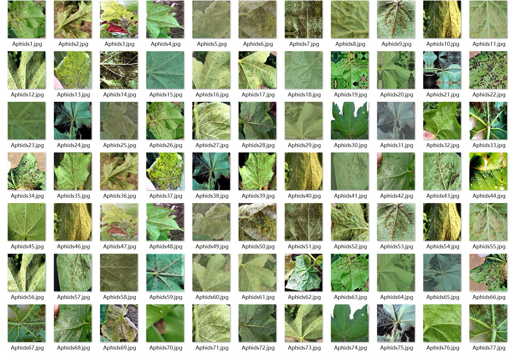
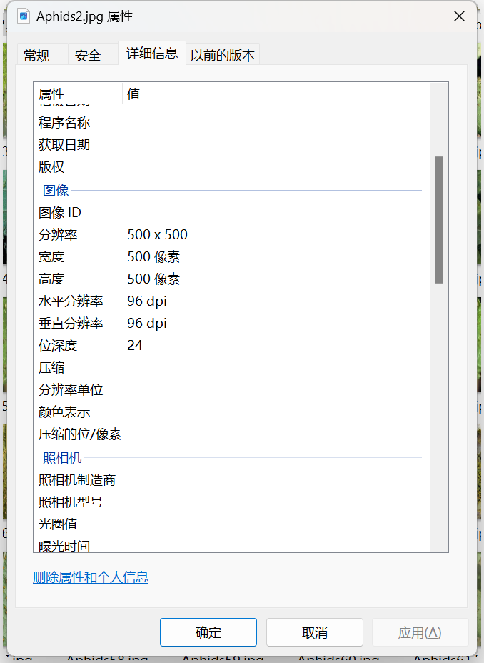

# Cotton Disease Image Classification Dataset

Complete Dataset Introduction:
- Number of images in the folder "Healthy Leaves": 600
- Number of images in the folder "White Powdery Mildew": 600
- Number of images in the folder "Bacterial Blight": 600
- Number of images in the folder "Leafhoppers": 600
- Number of images in the folder "Aphids": 600
- Number of images in the folder "Target Spot Disease" (Tubercle Blight): 600
Total number of images across all subfolders: 3600
Overall Screenshot:
Examples of dataset images:
Image resolution
## Images

Here is a pay link on Stripe ( https://buy.stripe.com/3cs8yP7sY87d0vu9AB ). Please contact me lonlonago@foxmail.com after funding $89, and I will send you a complete data files , thank you!

